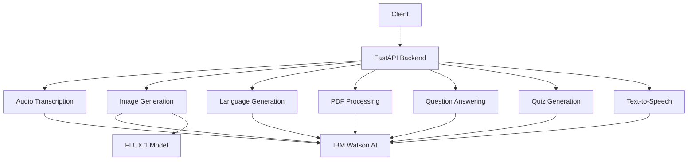

# 🌐 Arabic Learning Microservices Backend
## 🚀 Powering Arabic Language Intelligence

Welcome to the Arabic Learning Microservices Backend – revolutionizing Arabic language processing!

[LOGO PLACEHOLDER]

[](https://github.com/IbLahlou/atlas-innovator-backend-ild/releases/tag/v1.0)
[](https://www.python.org/)
[](https://fastapi.tiangolo.com/)

## 🧠 Project Overview
The Arabic Learning Microservices Backend is a cutting-edge project that pushes the boundaries of Arabic natural language processing and generation. Our repository houses a powerful FastAPI backend, creating a robust ecosystem for Arabic language intelligence.

[ARCHITECTURE DIAGRAM PLACEHOLDER]

## 🌟 Key Features
- 🎙️ Audio Transcription
- 🖼️ Image Generation
- 📚 Language Generation (Vocabulary, Sentences, Stories)
- 📄 PDF Processing
- 🤖 Question Answering
- 📝 Quiz Generation
- 🗣️ Text-to-Speech Conversion

## 🏗️ Architecture


## 🗺️ Repository Structure
```
atlas-innovator-backend-ild/
├── 🏛️ main.py
├── 🚀 routers/
│   ├── audio_transcription.py
│   ├── image_gen.py
│   ├── language_gen.py
│   ├── pdf_processing.py
│   ├── question_answering.py
│   ├── quiz.py
│   └── text_to_speech.py
├── 🛠️ utils.py
├── 📊 models/
├── 🧪 tests/
├── 🐳 Dockerfile
├── 📦 requirements.txt
├── 🔐 .env
└── 📜 README.md
```

## 🚀 Getting Started
### Setup and Installation
1. Clone the repository:
   ```
   git clone https://github.com/IbLahlou/atlas-innovator-backend-ild.git
   cd atlas-innovator-backend-ild
   ```
2. Set up your environment:
   ```
   python -m venv venv
   source venv/bin/activate  # On Windows use `venv\Scripts\activate`
   pip install -r requirements.txt
   ```
3. Set up environment variables:
   ```
   cp .env.example .env
   # Edit .env with your IBM Watson and other API credentials
   ```
4. Launch the backend:
   ```
   uvicorn main:app --reload
   ```

## 🛣️ API Endpoints
Our backend provides the following key endpoints:

- **POST /audio/transcribe**: Transcribe Arabic audio to text
- **POST /image/generate**: Generate images based on Arabic text
- **POST /language/generate**: Generate Arabic vocabulary, sentences, or stories
- **POST /pdf/process**: Process and extract text from Arabic PDFs
- **POST /qa/answer**: Answer questions based on processed content
- **POST /quiz/generate**: Generate Arabic language quizzes
- **POST /tts/synthesize**: Convert Arabic text to speech

For detailed API documentation, visit `/docs` after launching the backend.

---

<p align="center">
  <i>Arabic Learning Microservices Backend - Empowering Arabic NLP</i>
</p>